# Cómo llega una credencial de IBM Cloud a una aplicación

Documento de aprendizaje. Explica los mecanismos que existen para que una aplicación obtenga
las credenciales con las que conectarse a un servicio de IBM Cloud, cómo funciona cada uno y
cuándo conviene cada cual.

No es la decisión de este servicio: eso está en **[secret-manager.md](secret-manager.md)**, que
documenta lo que ContentMS hace hoy y por qué. Este documento es el fundamento — si aquello se
lee como una lista de siglas, empieza por aquí.

> **Nota sobre los diagramas.** Están en Mermaid, que GitHub y VS Code renderizan. Si tu visor
> no lo hace, verás el código: cada diagrama lleva debajo un párrafo que dice lo mismo en prosa,
> así que el documento se lee igual.

> **Nota sobre los ejemplos.** Todos los payloads son reales salvo donde se indique. Los valores
> sensibles están **redactados** con marcadores tipo `<REDACTADO>`; la forma es la auténtica.

---

## 1. El problema no es técnico, es de vocabulario

Cinco palabras se usan como si fueran sinónimos y no lo son: **servicio**, **instancia**,
**service credential**, **secreto** y **tipo de secreto**. De ahí salen preguntas que no tienen
respuesta porque están mal planteadas — "¿service credentials es un servicio?", "¿puedo pedir en
una sola llamada las credenciales de Mongo y de Redis?".

Casi todo lo demás se deduce solo una vez que esos cinco términos están en su sitio. Empecemos
por ahí.

---

## 2. Los cuatro niveles

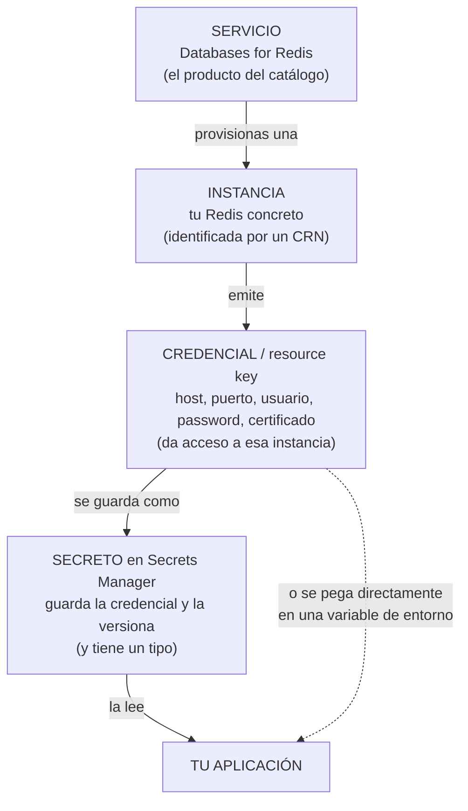

*En prosa:* del servicio del catálogo provisionas una instancia; la instancia emite credenciales;
una credencial puede guardarse en un secreto de Secrets Manager, o pegarse directamente en una
variable de entorno. La aplicación consume el último eslabón, sea el que sea.

| Término | Qué es | Lo que **no** es |
|---|---|---|
| **Servicio** | El producto del catálogo: Cloud Object Storage, Databases for Redis | No tiene credenciales; las tienen sus instancias |
| **Instancia** | Tu despliegue concreto de ese servicio, con su CRN | No es una base de datos ni un bucket: es el contenedor de ellos |
| **Service credential** (*resource key*) | El **artefacto** que da acceso a una instancia. Un JSON que emite la instancia | **No es un servicio.** Es un dato |
| **Secreto** | Una entrada en Secrets Manager, con nombre, grupo, versiones y estado | No es la credencial: es su envoltorio y su historial |
| **Tipo de secreto** | Cómo se obtuvo y qué forma tiene lo que hay dentro: `kv`, `service_credentials`, `iam_credentials`… | No dice de qué servicio es. Eso se fijó al crear el secreto |

La confusión más común: **`service_credentials` es un tipo de secreto, no un servicio.** Nombra
el mecanismo por el que Secrets Manager consiguió lo que guarda.

---

## 3. La idea de fondo: toda credencial viene de otra

Para leer una credencial de un sitio seguro hace falta una credencial. Eso no es un defecto del
diseño, es la naturaleza del problema — y lleva a una cadena que siempre termina en algún sitio.

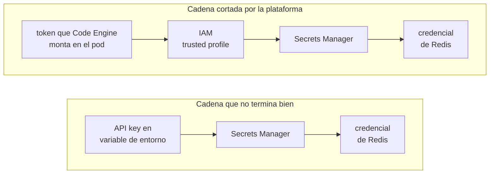

*En prosa:* con una API key, la cadena arranca en un secreto que sigue estando escrito en el
despliegue — has reducido N credenciales a una, pero no a cero. Con la identidad de plataforma,
la cadena arranca en un token que la propia plataforma pone en el pod y que nadie ha escrito en
ningún sitio: ahí sí llega a cero.

Ese primer eslabón se llama **bootstrap**, y aparece en todos los mecanismos que siguen. Es la
pregunta útil que hacerle a cualquier propuesta: *¿y esa credencial, de dónde sale?*

---

## 4. Los siete mecanismos

Todos resuelven lo mismo con compromisos distintos. Cada apartado sigue la misma plantilla:
cómo funciona, un ejemplo real, qué te entrega, cómo rota, cómo falla y cuándo elegirlo.

### 4.1 Variable de entorno plana

**Cómo funciona.** Una persona copia el valor a la configuración de la aplicación. No hay nada
más.

**Ejemplo real** — es lo que ContentMS hacía antes de integrar Secrets Manager, y lo que sus
YAML siguen leyendo (`src/main/resources/parameters/develop/storage.yaml`):

```yaml
storage:
  api-key: ${COS_API_KEY}
  service-instance-id: ${COS_SERVICE_INSTANCE_ID}
```

```bash
ibmcloud ce app update --name content-ms --env COS_API_KEY=<REDACTADO>
```

**Qué te entrega.** Exactamente lo que pegues, con el nombre que quieras.

**Rotación y auditoría.** Manual, y ninguna. Nadie sabe quién la leyó ni cuándo.

**Cómo falla.** Un placeholder sin valor revienta el arranque con
`Could not resolve placeholder 'COS_API_KEY'`. Es el fallo bueno: se ve al desplegar.

**Cuándo elegirlo.** Para lo que no es secreto (endpoints, nombres de bucket, TTLs) y para el
**bootstrap**, donde es inevitable. Para credenciales de servicio, es el punto de partida del que
se quiere salir.

### 4.2 Secret de Code Engine

**Cómo funciona.** El valor vive en un objeto `secret` de la plataforma, no en la configuración
de la app. Se puede inyectar como variables de entorno o montar como ficheros en un directorio
del pod.

**Ejemplo real:**

```bash
ibmcloud ce secret create --name cos-creds --from-literal COS_API_KEY=<REDACTADO>

# inyectado como variables
ibmcloud ce app update --name content-ms --env-from-secret cos-creds

# o montado como ficheros: /etc/creds/COS_API_KEY
ibmcloud ce app update --name content-ms --mount-secret /etc/creds=cos-creds
```

**Qué te entrega.** Lo mismo que 4.1, con mejor control de acceso.

**Rotación y auditoría.** Rotación manual. Inyectado como variable, cambiar el valor exige
reiniciar. Montado como volumen, en un runtime que propague el cambio al fichero, una aplicación
que lo releyera podría rotar en caliente — **si Code Engine lo propaga sin recrear la app está
sin verificar aquí**, conviene confirmarlo antes de contar con ello. Auditoría: la de Code Engine,
no la de un gestor de secretos.

**Cómo falla.** Igual que 4.1. Si el secreto no existe, el despliegue falla.

**Cuándo elegirlo.** Cuando no hay Secrets Manager, o para el bootstrap: es el sitio correcto
para poner `IBM_CLOUD_API_KEY`.

### 4.3 Service binding de Code Engine

**Cómo funciona.** Enlazas la instancia de servicio a la aplicación y la plataforma crea la
credencial y la inyecta como variables de entorno con prefijo, más un JSON agregado con todos
los bindings.

**Ejemplo:**

```bash
ibmcloud ce app bind --name content-ms --service-instance mi-cos --prefix COS
# aparecen COS_APIKEY, COS_RESOURCE_INSTANCE_ID, ... y un CE_SERVICES con todo
```

> Este apartado es el único del documento que no está verificado contra la documentación de
> IBM ni ensayado aquí. La forma exacta de las variables conviene confirmarla con DevOps antes
> de apoyarse en ella.

**Qué te entrega.** La credencial completa, sin SDK, sin llamada HTTP y **sin credencial de
bootstrap**: la plataforma hace el trabajo.

**Rotación y auditoría.** El binding se resuelve al desplegar, así que rotar es re-enlazar y
reiniciar.

**Cómo falla.** Si el binding no existe, las variables no están y el arranque falla por
placeholder sin resolver.

**Cuándo elegirlo.** Es el camino más corto si todo lo que consumes son servicios IBM enlazables
y no te importa acoplarte al runtime. El precio: **no se puede emular en local** — no hay
plataforma que enlace nada, así que se prueba desplegando.

### 4.4 Secrets Manager, tipo `kv` o `arbitrary`

**Cómo funciona.** Tú escribes el contenido del secreto. `arbitrary` guarda un `payload` de
texto; `kv` guarda un objeto JSON plano. Secrets Manager solo lo custodia: **es una caja
fuerte**, no sabe qué hay dentro.

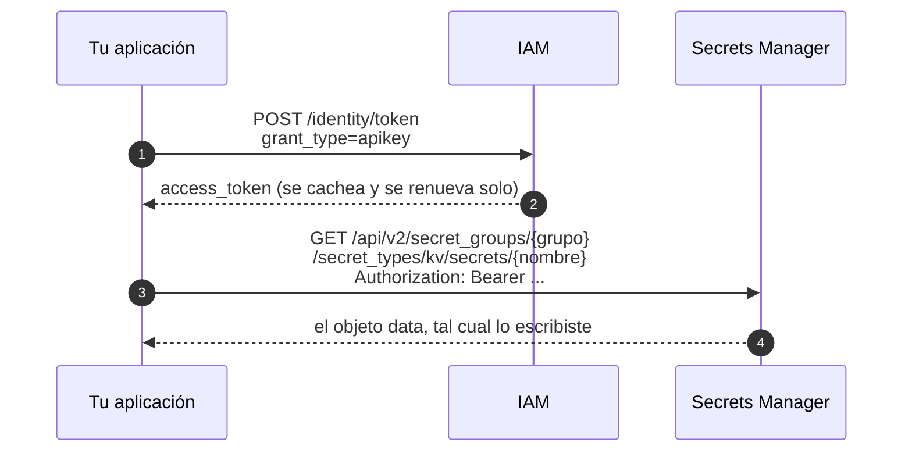

*En prosa:* dos saltos. Primero la aplicación canjea su API key por un token IAM (el SDK lo
cachea y lo renueva). Con ese token pide el secreto por grupo, tipo y nombre, y recibe el objeto
plano que alguien escribió a mano.

**Ejemplo real** — el secreto que sirve el stub local
(`deploy/secrets-manager-stub/mappings/secret-kv.json`) tiene la misma forma que el de IBM Cloud:

```json
{
  "name": "contentms-secrets",
  "secret_type": "kv",
  "secret_group_id": "default",
  "state_description": "active",
  "data": {
    "MINIO_ACCESS_KEY": "minioadmin",
    "MINIO_SECRET_KEY": "minioadmin",
    "COS_API_KEY": "stub-cos-api-key",
    "COS_SERVICE_INSTANCE_ID": "crn:v1:bluemix:public:cloud-object-storage:global:a/stub:stub::"
  }
}
```

**Qué te entrega.** Lo que pegaste, con las claves que tú elegiste. Ese control es el punto: si
las llamas igual que las variables que los YAML ya usaban, no hace falta ni una línea de mapeo
(es la decisión de ContentMS, §8).

**Rotación y auditoría.** Auditoría completa: Secrets Manager registra cada lectura. Rotación
**manual y en dos sitios** — si regeneras la credencial en el servicio, tienes que venir a
actualizar el `kv`. No puede rotar sola porque Secrets Manager no sabe qué guarda.

**Cómo falla.** Al arrancar y con nombre y apellidos: secreto inexistente, grupo equivocado,
permisos insuficientes.

**Cuándo elegirlo.** Cuando quieres controlar la forma, cuando un secreto agrupa credenciales de
**varios** servicios, o cuando lo que guardas no lo emite ningún servicio IBM (una clave de una
API de terceros, por ejemplo).

### 4.5 Secrets Manager, tipo `service_credentials`

**Cómo funciona.** Aquí Secrets Manager deja de ser caja fuerte y pasa a ser **emisor**. Le
indicas qué instancia y con qué rol, y él le pide la credencial al servicio, guarda la respuesta
y se queda como dueño de su ciclo de vida.

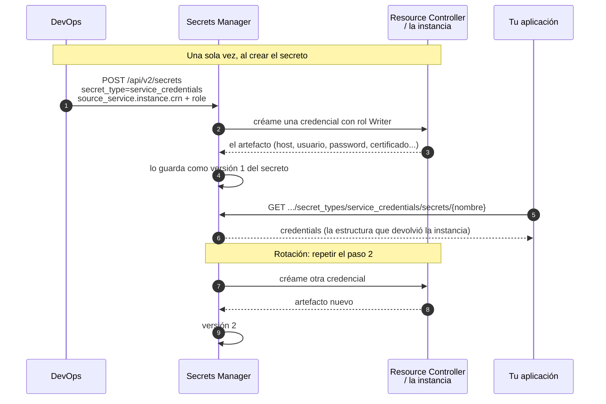

*En prosa:* al crear el secreto, Secrets Manager llama a la instancia y guarda lo que ésta le
devuelve. La aplicación luego solo lee. Rotar es volver a pedirle una credencial a la instancia
y guardar una versión nueva — y al expirar o borrar el secreto, Secrets Manager le pide a la
instancia que elimine la credencial. Eso es lo que significa "ser dueño del ciclo de vida".

**Requisito que sorprende:** para que el paso 2 funcione hace falta una **autorización IAM de
servicio a servicio**, con Secrets Manager como origen y el servicio destino como recurso. Sin
ella, crear el secreto falla. Es la diferencia estructural con `kv`, donde Secrets Manager no
habla con nadie.

**Ejemplo real de creación** (verificado contra la documentación de IBM):

```bash
ibmcloud secrets-manager secret-create \
  --secret-type="service_credentials" \
  --secret-name="redis-credentials" \
  --secret-source-service='{
     "instance": {"crn": "crn:v1:bluemix:public:databases-for-redis:br-sao:a/<CUENTA>:<INSTANCIA>::"},
     "role":     {"crn": "crn:v1:bluemix:public:iam::::serviceRole:Writer"}
   }'
```

Y con rotación automática, en Terraform:

```terraform
resource "ibm_sm_service_credentials_secret" "redis" {
  name = "redis-credentials"
  ttl  = "24h"
  source_service {
    instance = { crn = "crn:v1:bluemix:public:databases-for-redis:..." }
    role     = { crn = "crn:v1:bluemix:public:iam::::serviceRole:Writer" }
  }
  rotation {
    auto_rotate = true
    interval    = 1
    unit        = "day"
  }
}
```

**Ejemplo real del contenido** — este es el service credential de Redis que nos pasó DevOps
(`service-credentials/serviceCredentialsRedis.json`), recortado y **con los valores redactados**:

```json
{
  "connection": {
    "rediss": {
      "authentication": {
        "method": "direct",
        "username": "ibm_cloud_<REDACTADO>",
        "password": "<REDACTADO>"
      },
      "certificate": {
        "certificate_authority": "self_signed",
        "certificate_base64": "<REDACTADO: PEM en base64>",
        "name": "ac848ea9-<REDACTADO>"
      },
      "hosts": [
        { "hostname": "<INSTANCIA>.<CLUSTER>.private.databases.appdomain.cloud", "port": 31273 }
      ],
      "database": 0,
      "path": "/0",
      "scheme": "rediss",
      "type": "uri"
    },
    "cli": { "bin": "redli", "type": "cli", "...": "..." }
  },
  "instance_administration_api": {
    "deployment_id": "crn:v1:bluemix:public:databases-for-redis:br-sao:a/<CUENTA>:<INSTANCIA>::",
    "root": "https://api.br-sao.databases.cloud.ibm.com/v5/ibm"
  }
}
```

Fíjate en dos cosas, porque son el tema de §6: hay **mucho más que usuario y password**, y la
estructura es **anidada y la fija el servicio** — para el COS sería otra completamente distinta.

**Qué te entrega.** El artefacto completo que emite la instancia, incluido el material TLS.

**Rotación y auditoría.** Las dos, y buenas: rotación automática con `auto_rotate`, caducidad con
`ttl`, versiones, y registro de cada lectura.

**Cómo falla.** Al crear el secreto, si falta la autorización s2s. Al leerlo, como cualquier otro.
Y de forma más sutil: si la instancia cambia la forma del JSON, tu parser deja de encontrar los
campos.

**Cuándo elegirlo.** Cuando la credencial la emite un servicio IBM y quieres que la rotación no
la haga una persona. Es el estándar de DevOps aquí, y por eso este documento existe.

### 4.6 Secrets Manager, tipo `iam_credentials`

**Cómo funciona.** Secrets Manager crea **API keys de IAM** dinámicas contra una service ID.
La credencial nace cuando la pides y, si le pones `ttl`, muere al expirar.

**Ejemplo real de contenido** (de la documentación de IBM):

```json
{
  "secret_type": "iam_credentials",
  "api_key": "<REDACTADO>",
  "api_key_id": "ApiKey-dcd0b857-<REDACTADO>",
  "service_id": "ServiceId-bb4ccc31-<REDACTADO>"
}
```

**Qué te entrega.** Una API key de IAM y su identidad. Nada específico de conexión: ni host, ni
puerto, ni certificado.

**Rotación y auditoría.** Las mejores de la lista: la credencial puede ser efímera de verdad.

**Cómo falla.** Necesita su propia autorización s2s sobre `iam-identity`
(`ServiceIdCreator` + `Operator`). Y si el `ttl` es corto, falla **en caliente**: la app que leyó
al arrancar se queda con una credencial caducada.

**Cuándo elegirlo.** Para lo que se autentica con IAM — **el COS es exactamente ese caso**. No
sirve para Redis ni para Mongo, que usan usuario y password de ACL, no IAM. Y exige que la
aplicación sepa releer, algo que ContentMS hoy no hace (§8).

### 4.7 Identidad de plataforma (trusted profile y cr-token)

**Cómo funciona.** No es un almacén de credenciales: es la respuesta al bootstrap de §3. Code
Engine monta un token en el sistema de ficheros del pod; el SDK lo lee y lo canjea en IAM contra
un **trusted profile**. En el despliegue no queda ninguna credencial.

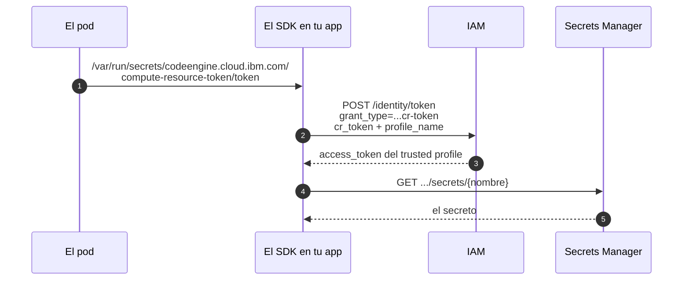

*En prosa:* la plataforma pone un token en un fichero del pod. El SDK lo lee, lo canjea en IAM
diciendo contra qué trusted profile, y a partir de ahí todo es igual que con una API key. Lo que
cambia es que nadie escribió nunca una credencial en el despliegue.

> **Estuvo implementado en este servicio y se retiró.** Era `secrets.auth-mode=container`, y
> funcionaba: el canje se ensayaba en local contra el mismo `POST /identity/token` del stub,
> apuntando a un fichero de token falso. Se quitó porque nunca llegó a usarse en un despliegue y
> mantener dos caminos de autenticación costaba tres propiedades, un authenticator y bastante
> documentación. Sigue aquí explicado porque el mecanismo existe y puede volver a interesar:
> el punto por donde entraría es `SecretsManagerClients`.

**Qué te entrega.** Identidad, no credenciales. Sirve para *llegar* al gestor.

**Rotación y auditoría.** El token lo gestiona la plataforma. Nada que rotar.

**Cómo falla.** Si el trusted profile no está enlazado a la app:

```text
IllegalStateException: No se pudo leer el secreto 'contentms-secrets' ... con autenticacion 'container'
Caused by: RuntimeException: Error reading CR token file: /var/run/secrets/...
```

**Cuándo elegirlo.** Siempre que la plataforma lo soporte y alguien pueda crear el trusted
profile. Es la única forma de que el despliegue no contenga credenciales. Ojo: elimina el
bootstrap, **no** las credenciales de Redis o Mongo, que no entienden IAM.

---

## 5. Cómo elegir

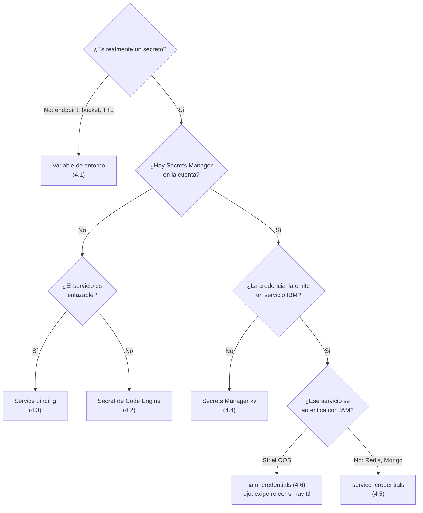

*En prosa:* lo que no es secreto va en variables de entorno. Lo que sí lo es, y no lo emite un
servicio IBM, va en un `kv`. Lo que lo emite un servicio IBM va en `service_credentials`, salvo
que el servicio hable IAM, donde `iam_credentials` es más fuerte. Sin Secrets Manager, el
camino corto es el service binding cuando el servicio lo admite.

Y en cualquiera de las ramas que pasan por Secrets Manager queda una pregunta más:

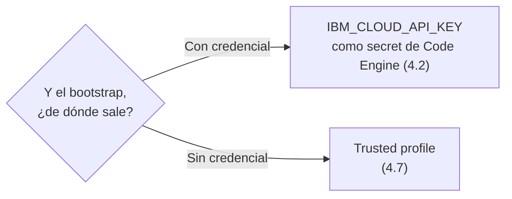

Resumen de compromisos:

| | Bootstrap | Forma del contenido | Rotación | Auditoría | ¿Ensayable en local? |
|---|---|---|---|---|---|
| **4.1** Env plana | — | La eliges tú | Manual | No | Trivial |
| **4.2** Secret de CE | — | La eliges tú | Manual | De la plataforma | Con variables |
| **4.3** Service binding | Ninguno | La fija IBM | Re-enlazar | De la plataforma | **No** |
| **4.4** `kv` | Necesario | La eliges tú | Manual, en dos sitios | Completa | Sí (stub) |
| **4.5** `service_credentials` | Necesario | La fija el servicio | **Automática** | Completa | Sí (stub) |
| **4.6** `iam_credentials` | Necesario | La fija IAM | **Automática, efímera** | Completa | Sí (stub) |
| **4.7** Trusted profile | **Ninguno** | — | — | Completa | Sí (stub) |

---

## 6. Una credencial de conexión no es usuario y password

Es lo que más se subestima, y lo que más cuesta después. Mira otra vez el service credential de
Redis de §4.5, campo por campo:

| Campo | Valor | Para qué sirve | ¿Lo soporta ContentMS hoy? |
|---|---|---|---|
| `scheme` | `rediss` | **TLS obligatorio.** No es `redis` | ✅ |
| `hosts[0].hostname` | `….private.databases.appdomain.cloud` | Endpoint **privado**: solo resuelve desde dentro | Configurable |
| `hosts[0].port` | `31273` | No es 6379 | ✅ |
| `authentication.username` | `ibm_cloud_…` | Usuario de **ACL**. Redis 6+ lo exige | ✅ |
| `authentication.password` | `<REDACTADO>` | La password | ✅ |
| `database` | `0` | Índice de base de datos | Por defecto |
| `certificate.certificate_base64` | PEM en base64 | **La CA que hay que confiar** | ✅ |
| `certificate.certificate_authority` | `self_signed` | La JVM **no** la conoce de fábrica | ✅ |

Los ocho campos se leen ya del service credential, pero el punto sigue siendo válido y vale la pena entender por qué hizo falta trabajo: **tres de ellos no tenían sitio en la configuración** antes de `IbmRedisCredentialsSource`: `cache.yaml` solo declaraba
`host`, `port` y `password`, y no existía `spring.data.redis.username` ni `ssl` en ningún
fichero del repo.

La solución no fue construir un cliente a mano. `IbmRedisCredentialsSource` traduce el secreto
a propiedades —incluida la CA, que se registra como un **SSL bundle con el PEM en línea**— y
`spring.data.redis.ssl.bundle` hace el resto: la `RedisConnectionFactory` sigue saliendo de la
autoconfiguración y `CacheConfig` sigue sin saber que nada de esto existe.

Esto es lo importante: **el problema no es de dónde sacas la credencial, sino qué campos necesita
la conexión.** Cambiar de `kv` a `service_credentials` no lo resuelve; ni cambiar a un service
binding.

Cómo se prueba todo esto en local, y qué variables hay que poner en cada entorno, en
**[redis-instruction.md](redis-instruction.md)**.

### Por qué el certificado es el campo difícil

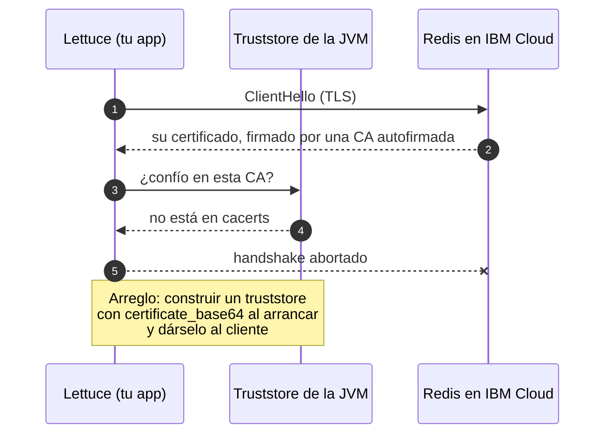

*En prosa:* la JVM trae un almacén de CAs públicas. La CA de esa instancia de Redis no está ahí,
porque es autofirmada, así que el handshake se corta. La solución es decodificar el
`certificate_base64` al arrancar, meterlo en un `KeyStore` en memoria y configurar el cliente
para que lo use.

**Y el fallo sería silencioso.** `CacheConfig.errorHandler()` degrada cualquier error de Redis a
un WARN y la petición sigue contra el COS, y `management.health.redis.enabled` está en `false` en
todos los perfiles (a propósito: una caché caída no debe reiniciar el pod). Resultado: TLS roto
→ **200 en todas las peticiones y una caché que no cachea nada**. La única prueba de que funciona
es ver las claves en Redis, no un health check verde.

El del COS, por contraste, es casi plano — no hay TLS que configurar porque es HTTPS con CA
pública:

```json
{
  "apikey": "<REDACTADO>",
  "resource_instance_id": "crn:v1:bluemix:public:cloud-object-storage:global:a/<CUENTA>:<INSTANCIA>::",
  "endpoints": "https://control.cloud-object-storage.cloud.ibm.com/v2/endpoints",
  "iam_role_crn": "crn:v1:bluemix:public:iam::::serviceRole:Writer",
  "cos_hmac_keys": { "access_key_id": "<REDACTADO>", "secret_access_key": "<REDACTADO>" }
}
```

> Este payload de COS es **representativo, no capturado**: no tenemos uno real en el repo. La
> forma es la habitual, pero conviene verificarla cuando llegue el de verdad.

Nota de paso: `cos_hmac_keys` solo aparece si al crear el secreto se pidió
`parameters: {"HMAC": true}`. Es lo que permitiría firmar HMAC contra el COS igual que se hace
contra MinIO en local.

---

## 7. Secrets Manager en detalle

### 7.1 Caja fuerte o emisor

La misma pieza juega dos papeles según el tipo de secreto, y es la distinción que más aclara:

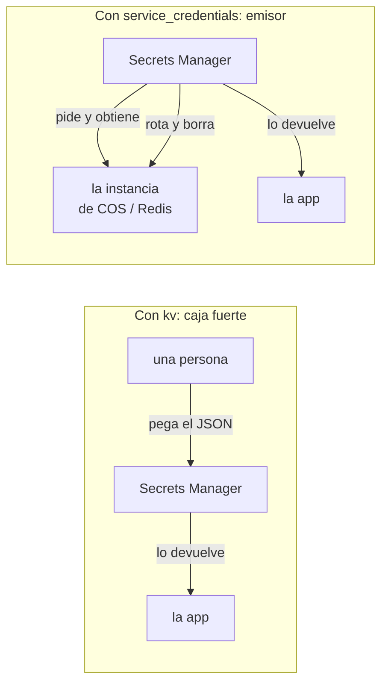

*En prosa:* con `kv`, Secrets Manager no habla con nadie: guarda lo que le pegaste. Con
`service_credentials` habla con tu instancia, y por eso puede rotar y borrar la credencial allí.

De ahí salen dos relaciones IAM **independientes**, y conviene no confundirlas:

1. **Secrets Manager → la instancia**: una autorización de servicio a servicio. Solo existe con
   `service_credentials` e `iam_credentials`.
2. **Tu app → Secrets Manager**: el rol `SecretsReader`, más una identidad (API key o trusted
   profile). Es la que ContentMS ya tiene resuelta.

### 7.2 Versiones, rotación y `ttl`

Un secreto no guarda un valor, guarda un **historial de versiones**. Rotar es crear una versión
nueva; `ttl` marca cuándo caduca. Para `service_credentials`, además, la caducidad o el borrado
del secreto se propagan a la instancia: la credencial deja de existir allí.

Eso tiene una consecuencia directa sobre el diseño de la aplicación: **si lees una sola vez al
arrancar, cualquier rotación exige reiniciar el pod.** Es aceptable con rotaciones raras y
planificadas; deja de serlo con un `ttl` de horas.

### 7.3 Por qué dos secretos son dos llamadas

La API v2 tiene dos operaciones distintas:

- `GET /api/v2/secret_groups/{grupo}/secret_types/{tipo}/secrets/{nombre}` → devuelve **el valor**,
  de un secreto.
- `GET /api/v2/secrets` → lista, pero **solo metadatos** (nombre, tipo, estado, número de
  versiones). No trae el material, precisamente para que cada lectura de un valor quede
  registrada.

No hay operación de lote para valores. Y como un `service_credentials` lleva un solo
`source_service.instance.crn`, es la credencial de **una** instancia. Por tanto: dos servicios,
dos secretos, dos lecturas. No es una limitación evitable con un truco de configuración.

---

## 8. Caso real 1: cómo lo hace ContentMS hoy

ContentMS usa un único secreto **`kv`** cuyas claves se llaman **igual que las variables de
entorno que los YAML ya usaban**. Ese detalle es todo el diseño.

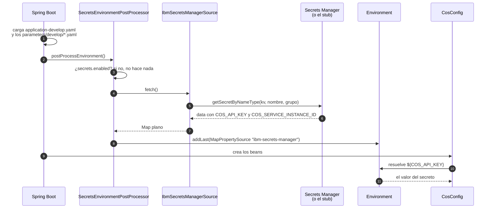

*En prosa:* un `EnvironmentPostProcessor` corre antes de que exista el contexto de Spring, lee el
secreto y registra sus claves como una fuente de propiedades más. Cuando después alguien resuelve
`${COS_API_KEY}`, el valor sale de ahí sin que nadie sepa de dónde vino.

El resultado buscado: **ni `StorageProperties`, ni `CosConfig`, ni un solo YAML saben que Secrets
Manager existe.** Y añadir un secreto nuevo es una clave en el JSON más un `${VARIABLE}` en un
YAML, sin tocar Java.

Cuatro detalles del diseño que conviene conocer, todos explicados a fondo en
[secret-manager.md](secret-manager.md):

- **`addLast()`, no `addFirst()`**: una variable de entorno real **gana** al secreto. Es una vía
  de escape deliberada, y también una trampa (§12).
- **Se lee una vez.** No hay refresco. Rotar es reiniciar.
- **Si falla, no arranca.** Al contrario que la caché, que degrada a *miss*: detrás de la caché
  hay un almacén durable, detrás de unas credenciales ausentes solo hay un 500.
- **Nunca se loguean valores**, solo el listado de claves cargadas.

Y el detalle que delata que este código corre muy temprano: el post-processor recibe un
`DeferredLogFactory` en el constructor, porque **el sistema de logging todavía no existe** cuando
se ejecuta.

---

## 9. Caso real 2: cómo lo hace el proyecto de referencia

`ap6616-cos-documents-ms-app-repo` lee un `service_credentials` de Mongo, y lo hace al revés:
un bean tipado que cada consumidor inyecta.

```java
// GetCredentialsRequestFactory: de dónde sale QUÉ secreto leer
@Component
@Profile("lit")
public class GetCredentialsRequestFactory {
    @Value("${ibm.secret-manager.url}")                            private String serviceUrl;
    @Value("${ibm.secret-manager.service-credentials-secret-group}") private String secretGroupName;
    @Value("${ibm.secret-manager.service-credentials-secret-name}")  private String serviceCredentialsName;
    @Value("${ibm.apiKey}")                                        private String apiKey;
    ...
}
```

```java
// GetCredentialsCommand: la lectura y el mapeo
ServiceCredentialsSecretCredentials secret = service.getSecretByNameType(
        new GetSecretByNameTypeOptions.Builder()
                .name(this.serviceCredentialsName)
                .secretGroupName(this.secretGroup)
                .secretType("service_credentials")
                .build())
        .execute().getResult().getCredentials();

LinkedTreeMap<String, LinkedTreeMap<String, ?>> connection =
        (LinkedTreeMap<String, LinkedTreeMap<String, ?>>) secret.getProperties().get("connection");

var authentication = connection.get("mongodb").get("authentication");
var host1 = ((List<LinkedTreeMap<String, ?>>) connection.get("mongodb").get("hosts")).get(0);

return DbConnectionSettings.builder()
        .username(((LinkedTreeMap<String, String>) authentication).get("username"))
        .password(((LinkedTreeMap<String, String>) authentication).get("password"))
        .hostname1((String) host1.get("hostname"))
        .port1(((LazilyParsedNumber) host1.get("port")).intValue())
        // ... host2, host3
        .databaseName((String) connection.get("mongodb").get("database"))
        .build();
```

Tres cosas que enseña este código mejor que cualquier explicación:

**Ningún parámetro nombra el servicio.** Los cuatro `@Value` identifican la instancia de Secrets
Manager, el grupo, el nombre del secreto y la identidad que lo lee. Qué instancia de Mongo hay
detrás se fijó **al crear el secreto**, en su `source_service.instance.crn`, y desde el cliente es
invisible. El `secretType` dice `service_credentials` — el *cómo*, no el *de qué*.

**El único sitio del código que sabe de qué servicio se trata es el parser.** Ese
`connection.get("mongodb")` es una consecuencia de la forma que devolvió la instancia, no una
elección de la petición. Para Redis sería `connection.get("rediss")` y los campos de dentro son
otros.

**Los tres hosts están fijos** (`host1`, `host2`, `host3`) porque es un replica set de Mongo. Es
un detalle de ese caso, no un patrón a copiar: el service credential de Redis trae `hosts` con un
solo elemento, y nada garantiza que siempre sea uno.

Comparado con ContentMS (§8): más explícito en un stack trace, más fácil de seguir, y obliga a
tocar código por cada secreto nuevo. Son dos posturas legítimas y opuestas.

---

## 10. Varios service credentials, y un servicio sin `kv`

Hoy ContentMS lee **dos secretos** de distinto tipo: el `kv` con las credenciales del COS y un
`service_credentials` con la conexión a Redis. Cada uno tiene su origen y su fuente de
propiedades:

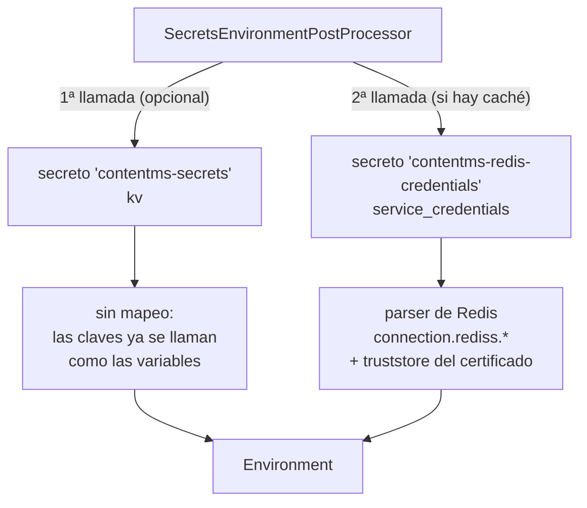

*En prosa:* dos lecturas independientes, con tratamientos distintos. El `kv` se vuelca tal cual
porque sus claves ya se llaman como las variables de los YAML; el service credential hay que
navegarlo y traducirlo. Sus resultados van a dos fuentes de propiedades separadas, para que un
fallo diga cuál de los dos secretos fue.

### 10.1 El `kv` es opcional

**`secrets.name` vacío significa "no hay secreto `kv`"**, y entonces no se lee ninguno. Es la
misma convención de "vacío = no aplica" que usa `secrets.redis.group`.

Existe ese hueco porque **un servicio puede no tener ningún `kv`**. Si todas sus credenciales
llegan como service credentials —Redis, Mongo, o el propio COS el día que DevOps lo entregue
así—, ese secreto sobra y `SECRETS_NAME`/`SECRETS_GROUP` dejan de tener sentido. No es
hipotético: el proyecto de referencia (`ap6616-cos-documents-ms-app-repo`) es exactamente ese
caso — sus cuatro parámetros son la URL, el nombre y el grupo de **un service credential**, y la
API key. Ningún `kv`.

Que se salte deja traza en el arranque, a propósito:

```
Sin secreto kv (secrets.name vacio): las credenciales del COS tienen que llegar por variable de entorno
```

Un despliegue sin credenciales del COS no falla al arrancar: falla mucho más tarde, con un 503
en la primera subida. Conviene poder mirar el log y ver que fue deliberado.

### 10.2 Lo que sí costaría: N servicios

Leer más secretos es un bucle, y es la parte fácil. **Lo que no se generaliza es el mapeo.**

Secrets Manager garantiza el envoltorio —`credentials` en la raíz, comprobado contra el modelo
del SDK (§7)— pero de ahí para dentro la forma la fija **el servicio enlazado**, y para el SDK
es un objeto libre:

```java
connection.get("rediss")    // hosts[1], authentication, certificate, database
connection.get("mongodb")   // hosts[N] (replica set), authentication, database
```

Mongo trae varios hosts porque es un replica set —el código de referencia fija `host1`, `host2`,
`host3`—, Redis trae uno y además un certificado que hay que convertir en truststore. No hay un
mapeo común: **un parser por servicio**, y cada uno traduce a las propiedades que espera su
cliente (`spring.data.redis.*`, `spring.data.mongodb.*`, `storage.*`).

Así que un servicio "todo service credentials" necesitaría, además de lo que ya hay:

1. una **lista** de secretos en configuración, en vez de bloques fijos;
2. un **parser por servicio**, que es donde está el trabajo real;
3. el bucle en el post-processor, que es trivial;
4. tantos mappings en el stub local como secretos, cada uno con su `urlPath` literal.

Nada de esto toca `domain` ni `application`, que no saben que Redis ni Secrets Manager existen.

> **Cuándo construir eso: cuando haya un segundo service credential de verdad, no antes.** Con
> uno solo, cualquier abstracción es una conjetura sobre cómo será el siguiente. Hay precedente
> en este mismo trabajo: la duda de si `credentials` colgaba de la raíz se resolvió mirando el
> SDK en diez minutos, no razonando en abstracto. Con el payload de Mongo delante pasará lo
> mismo, y probablemente la forma correcta sea más simple de lo que se diseñaría a ciegas.

## 11. Cómo se ensaya todo esto en local

El principio: **no se cambia de adaptador, se cambia de destino.** El compose levanta un WireMock
en el 8090 que responde al endpoint de token de IAM y a la API v2 de Secrets Manager, así que en
local se recorre el mismo camino de código que en Code Engine — mismo SDK, misma negociación de
token, misma llamada, mismo parseo.

```bash
podman-compose -f deploy/docker-compose.yaml up -d
podman logs contentms-secrets-stub
# POST /identity/token
# GET  /api/v2/secret_groups/default/secret_types/kv/secrets/contentms-secrets
```

**La prueba de que el mecanismo funciona de verdad** es romperlo: en el perfil `local` el secreto
lleva `MINIO_ACCESS_KEY`/`MINIO_SECRET_KEY`, que son las credenciales con las que el servicio
firma contra MinIO. Pon una mal, reinicia el stub, y la subida falla con un 503
`STORAGE_UNAVAILABLE`. Con la buena, 201. Sin tocar nada más.

| Mecanismo | ¿Se puede ensayar sin plataforma? |
|---|---|
| Env plana, secret de Code Engine | Sí, trivial |
| `kv`, `service_credentials`, `iam_credentials` | **Sí**: el stub sirve cualquier tipo, solo cambia la ruta y el cuerpo |
| Trusted profile (4.7) | **Sí** lo era, con un fichero de token falso, mientras estuvo implementado. Lo que nunca demostró es que Code Engine monte el token ni que el perfil tenga permiso |
| Service binding (4.3) | **No** |
| TLS de Redis con CA autofirmada | Parcialmente: haría falta un MinIO/Redis local con TLS y su propia CA |

Y para trabajar sin stub: `SECRETS_ENABLED=false` desactiva el mecanismo entero y los valores
vuelven a salir de variables de entorno.

---

## 12. Catálogo de fallos, y cómo se ven

| Síntoma | Causa | Dónde mirar |
|---|---|---|
| `Could not resolve placeholder 'COS_API_KEY'` al arrancar | La clave no está en el secreto, o `secrets.enabled=false` sin variable de respaldo | El listado de claves cargadas que loguea el post-processor |
| `IllegalStateException: No se pudo leer el secreto …` | Nombre, grupo, URL o permisos mal | El mensaje nombra secreto, grupo, URL y modo de autenticación |
| `Caused by: Error reading CR token file` | Modo `container` sin trusted profile enlazado | Que DevOps haya enlazado el perfil a la app |
| **El secreto se lee bien pero el valor es el viejo** | Una variable de entorno real está sombreando el secreto: `addLast()` | El env del despliegue. Un `COS_API_KEY` olvidado gana siempre |
| **200 en todo y la caché vacía** | Redis inalcanzable, TLS roto o (de)serialización fallando. El `errorHandler` lo degrada a WARN y el health de Redis está desactivado | `redis-cli KEYS 'contentms:*'`, y los WARN del log. **Nunca un health check** |
| Timeout al conectar, sin más pistas | Endpoint `.private.…` desde una red que no lo alcanza | Service endpoints y VRF en la cuenta |
| `SSLHandshakeException: unable to find valid certification path` | La CA autofirmada del servicio no está en el truststore | §6 |
| Al crear un `service_credentials`: `resource_create_error` | Falta la autorización IAM de servicio a servicio | §7.1 |

El patrón que se repite: **los fallos de credenciales son ruidosos y aparecen al arrancar; los de
conectividad de la caché son silenciosos y aparecen como si todo fuera bien.** Los primeros se
arreglan solos leyendo el mensaje; los segundos hay que ir a buscarlos.

---

## 13. Glosario

| Término | Qué es |
|---|---|
| **CRN** | Cloud Resource Name. El identificador global de un recurso de IBM Cloud. Aparece en todas partes: instancias, roles, secretos |
| **Resource key** | El nombre interno de una *service credential*: la credencial que emite una instancia |
| **Service credential** | El artefacto (JSON) que da acceso a una instancia. **No es un servicio** |
| **`service_credentials`** | El tipo de secreto de Secrets Manager que crea y custodia ese artefacto |
| **Grupo de secretos** | Carpeta lógica dentro de Secrets Manager. Sirve para acotar permisos |
| **`SecretsReader`** | Rol IAM que permite **leer el valor** de los secretos, y nada más |
| **Autorización s2s** | Política IAM que permite a un servicio actuar sobre otro. La necesita Secrets Manager para emitir credenciales |
| **Trusted profile** | Identidad IAM que no tiene credenciales: se la asume presentando una prueba, como el token de un pod |
| **cr-token** | *Compute resource token*. El fichero que Code Engine monta en el pod y que se canjea contra un trusted profile |
| **Bootstrap** | La credencial o identidad con la que se llega al gestor de secretos. Siempre existe |
| **`EnvironmentPostProcessor`** | Punto de extensión de Spring Boot que corre antes del contexto. Donde ContentMS inyecta el secreto |
| **HMAC** | Firma de estilo S3, alternativa a IAM para el COS. Solo aparece en el service credential si se pidió al crearlo |

---

## Para seguir

- **[secret-manager.md](secret-manager.md)** — qué hace este servicio, por qué, y cómo se
  despliega. La §10 de ese documento contiene el análisis de qué cambiaría al pasar a
  `service_credentials`.
- **[README.md](README.md)** §6 — la tabla completa de variables de entorno por perfil.
- **[`deploy/secrets-manager-stub/README.md`](deploy/secrets-manager-stub/README.md)** — el stub
  local en detalle.
